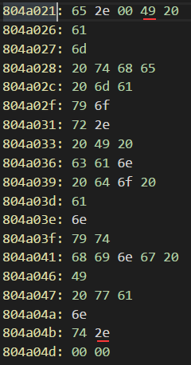
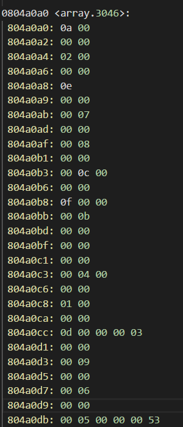
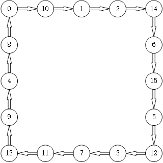
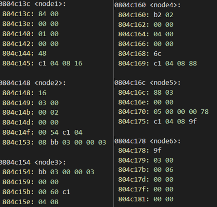
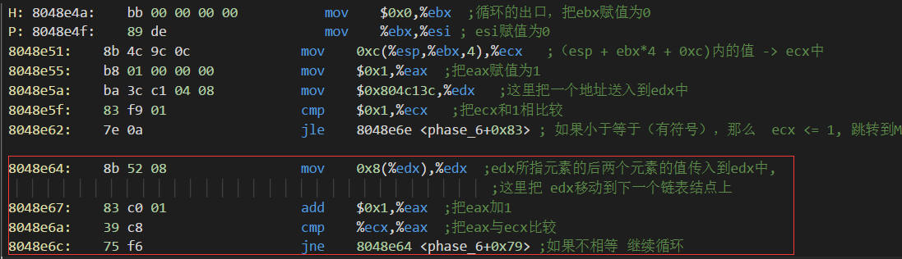
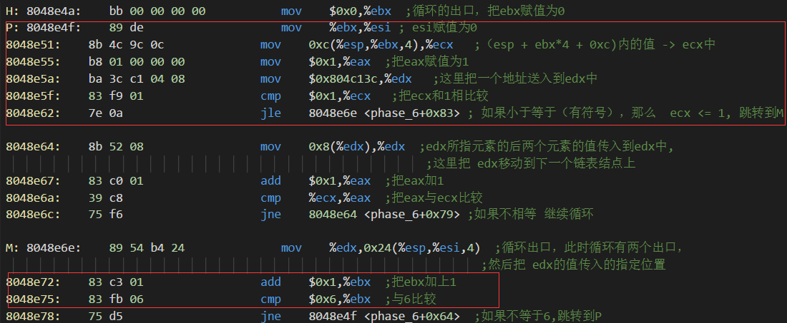
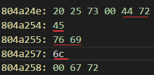

# 1 实验内容
本实验中， 你要使用课程所学知识拆除一个“binary bombs”来增强对程序
的机器级表示、汇编语言、调试器和逆向工程等方面原理与技能的掌握。
一个“binary bombs”（二进制炸弹，下文将简称为炸弹）是一个 Linux 可执
行 C 程序，包含了 6 个阶段（phase1~phase6）。炸弹运行的每个阶段要求你输入
一个特定的字符串， 若你的输入符合程序预期的输入，该阶段的炸弹就被“拆除”，
否则炸弹“爆炸” 并打印输出 "BOOM!!!"字样。实验的目标是拆除尽可能多的炸
弹层次。
每个炸弹阶段考察了机器级语言程序的一个不同方面，难度逐级递增：
* 阶段 1：字符串比较
* 阶段 2：循环
* 阶段 3：条件/分支
* 阶段 4：递归调用和栈
* 阶段 5：指针
* 阶段 6：链表/指针/结构
* 另外还有一个隐藏阶段， 但只有当你在第 4 阶段的解之后附加一特定字符串后才会出现。
# 2 实验步骤
## 2.1 字符串比较
在第一个小题中，需要对main函数的内容有一个基本的了解。在objdump反汇编中来的代码中找到main函数的代码段如下：
``` 
 08048b42 <phase_1>:
 8048b42:    83 ec 14                 sub    $0x14,%esp  ;分配堆栈
 8048b45:    68 24 a0 04 08           push   $0x804a024 ;参数入栈
 8048b4a:    ff 74 24 1c              pushl  0x1c(%esp)  ;输入的字符串地址入栈
 8048b4e:    e8 c9 04 00 00           call   804901c <strings_not_equal> ;调用字符串相等函数，如果相等,那么eax返回0，否则返回1
 8048b53:    83 c4 10                 add    $0x10,%esp  ;堆栈移动
 8048b56:    85 c0                    test   %eax,%eax  ;eax判断是否为0
 8048b58:    75 04                    jne    8048b5e <phase_1+0x1c>  ;如果不为0，直接爆炸
 8048b5a:    83 c4 0c                 add    $0xc,%esp  ;堆栈释放
 8048b5d:    c3                       ret     ;返回
 8048b5e:    e8 ae 05 00 00           call   8049111 <explode_bomb>  ;爆炸
 8048b63:    eb f5                    jmp    8048b5a <phase_1+0x18>  ;出口
 ```
通过对main函数的分析，发现帮助不大，只是完成了一些初始化的操作。接着往下看main函数紧接着的代码段:
```
__fortify_function int
printf (const char *__restrict __fmt, ...)
{
  return __printf_chk (__USE_FORTIFY_LEVEL - 1, __fmt, __va_arg_pack ());
 8048a26:    83 ec 0c                 sub    $0xc,%esp
 8048a29:    68 6c 9f 04 08           push   $0x8049f6c
 8048a2e:    e8 8d fd ff ff           call   80487c0 <puts@plt>
 8048a33:    c7 04 24 a8 9f 04 08     movl   $0x8049fa8,(%esp)
 8048a3a:    e8 81 fd ff ff           call   80487c0 <puts@plt>
 8048a3f:    e8 2d 07 00 00           call   8049171 <read_line>
 8048a44:    89 04 24                 mov    %eax,(%esp)
 8048a47:    e8 f6 00 00 00           call   8048b42 <phase_1>
 8048a4c:    e8 1f 08 00 00           call   8049270 <phase_defused>
 8048a51:    c7 04 24 d4 9f 04 08     movl   $0x8049fd4,(%esp)
 8048a58:    e8 63 fd ff ff           call   80487c0 <puts@plt>
 8048a5d:    e8 0f 07 00 00           call   8049171 <read_line>
 8048a62:    89 04 24                 mov    %eax,(%esp)
 8048a65:    e8 fb 00 00 00           call   8048b65 <phase_2>
 8048a6a:    e8 01 08 00 00           call   8049270 <phase_defused>
 8048a6f:    c7 04 24 21 9f 04 08     movl   $0x8049f21,(%esp)
 8048a76:    e8 45 fd ff ff           call   80487c0 <puts@plt>
 8048a7b:    e8 f1 06 00 00           call   8049171 <read_line>
 8048a80:    89 04 24                 mov    %eax,(%esp)
 8048a83:    e8 44 01 00 00           call   8048bcc <phase_3>
 8048a88:    e8 e3 07 00 00           call   8049270 <phase_defused>

 8048a8d:    c7 04 24 3f 9f 04 08     movl   $0x8049f3f,(%esp)
 8048a94:    e8 27 fd ff ff           call   80487c0 <puts@plt>
 8048a99:    e8 d3 06 00 00           call   8049171 <read_line>
 8048a9e:    89 04 24                 mov    %eax,(%esp)
 8048aa1:    e8 42 02 00 00           call   8048ce8 <phase_4>
 8048aa6:    e8 c5 07 00 00           call   8049270 <phase_defused>

 8048aab:    c7 04 24 00 a0 04 08     movl   $0x804a000,(%esp)
 8048ab2:    e8 09 fd ff ff           call   80487c0 <puts@plt>
 8048ab7:    e8 b5 06 00 00           call   8049171 <read_line>
 8048abc:    89 04 24                 mov    %eax,(%esp)
 8048abf:    e8 98 02 00 00           call   8048d5c <phase_5>
 8048ac4:    e8 a7 07 00 00           call   8049270 <phase_defused>
 8048ac9:    c7 04 24 4e 9f 04 08     movl   $0x8049f4e,(%esp)
 8048ad0:    e8 eb fc ff ff           call   80487c0 <puts@plt>
 8048ad5:    e8 97 06 00 00           call   8049171 <read_line>
 8048ada:    89 04 24                 mov    %eax,(%esp)
 8048add:    e8 09 03 00 00           call   8048deb <phase_6>
 8048ae2:    e8 89 07 00 00           call   8049270 <phase_defused>
 8048ae7:    83 c4 10                 add    $0x10,%esp
 8048aea:    b8 00 00 00 00           mov    $0x0,%eax
 8048aef:    8d 65 f8                 lea    -0x8(%ebp),%esp
 8048af2:    59                       pop    %ecx
 8048af3:    5b                       pop    %ebx
 8048af4:    5d                       pop    %ebp
 8048af5:    8d 61 fc                 lea    -0x4(%ecx),%esp
 8048af8:    c3                       ret    
 8048af9:    a1 c0 c3 04 08           mov    0x804c3c0,%eax
 8048afe:    a3 d0 c3 04 08           mov    %eax,0x804c3d0
 8048b03:    e9 19 ff ff ff           jmp    8048a21 <main+0x46>
 8048b08:    ff 73 04                 pushl  0x4(%ebx)
 8048b0b:    ff 33                    pushl  (%ebx)
 8048b0d:    68 ea 9e 04 08           push   $0x8049eea
 8048b12:    6a 01                    push   $0x1
 8048b14:    e8 27 fd ff ff           call   8048840 <__printf_chk@plt>
 8048b19:    c7 04 24 08 00 00 00     movl   $0x8,(%esp)
 8048b20:    e8 bb fc ff ff           call   80487e0 <exit@plt>
 8048b25:    83 ec 04                 sub    $0x4,%esp
 8048b28:    ff 33                    pushl  (%ebx)
 8048b2a:    68 07 9f 04 08           push   $0x8049f07
 8048b2f:    6a 01                    push   $0x1
 8048b31:    e8 0a fd ff ff           call   8048840 <__printf_chk@plt>
 8048b36:    c7 04 24 08 00 00 00     movl   $0x8,(%esp)
 8048b3d:    e8 9e fc ff ff           call   80487e0 <exit@plt>
 ```
 从上面的代码中可以清晰的看到，我们需要输入一些参数，然后调用相关的函数，所有的逻辑都在函数中。所以下面只用分析phase函数里面的逻辑。这里才是真正进入到拆弹的工作当中。
 首先给出phase1函数的反汇编代码:
 ```
 08048b42 <phase_1>:
 8048b42:    83 ec 14                 sub    $0x14,%esp  ;分配堆栈
 8048b45:    68 24 a0 04 08           push   $0x804a024 ;参数入栈
 8048b4a:    ff 74 24 1c              pushl  0x1c(%esp)  ;输入的字符串地址入栈
 8048b4e:    e8 c9 04 00 00           call   804901c <strings_not_equal> ;调用字符串相等函数，如果相等，那么eax返回0，否则返回1
 8048b53:    83 c4 10                 add    $0x10,%esp  ;堆栈移动
 8048b56:    85 c0                    test   %eax,%eax  ;eax判断是否为0
 8048b58:    75 04                    jne    8048b5e <phase_1+0x1c>  ;如果不为0，直接爆炸
 8048b5a:    83 c4 0c                 add    $0xc,%esp  ;堆栈释放
 8048b5d:    c3                       ret     ;返回
 8048b5e:    e8 ae 05 00 00           call   8049111 <explode_bomb>  ;爆炸
 8048b63:    eb f5                    jmp    8048b5a <phase_1+0x18>  ;出口
 ```
 从图中可以看出解题思路为输入字符串并且与内存中的数据进行比较，如果相等那么拆弹成功。找到地址0x804a024处的数据如图所示
<div style="text-align: center; width: 500px; solid 1px;">
 
 </div>
 由ASCII表转换得到数据“I am the mayor. I can do anything I want.”输入这段字符串，成功拆除第一个炸弹。

 ## 2.2 循环
此前已经分析了main函数中的内容，所以大致知道了流程：输入字符串然后通过一系列逻辑得到最后的结果。贴出phase2的代码如下：
```
08048b65 <phase_2>:
 8048b65:    56                       push   %esi  ;保护寄存器
 8048b66:    53                       push   %ebx
 8048b67:    83 ec 2c                 sub    $0x2c,%esp   ;堆栈分配
 8048b6a:    65 a1 14 00 00 00        mov    %gs:0x14,%eax  ;哨兵值，防止堆栈溢出和错误
 8048b70:    89 44 24 24              mov    %eax,0x24(%esp)  ;传入参数
 8048b74:    31 c0                    xor    %eax,%eax  ;把eax置0
 8048b76:    8d 44 24 0c              lea    0xc(%esp),%eax ;把堆栈中的传入参数给eax
 8048b7a:    50                       push   %eax  ;传入参数
 8048b7b:    ff 74 24 3c              pushl  0x3c(%esp)   ;传入参数
 8048b7f:    e8 b2 05 00 00           call   8049136 <read_six_numbers> ;调用读取六个数字的函数 
 8048b84:    83 c4 10                 add    $0x10,%esp  ;堆栈移动
 8048b87:    83 7c 24 04 01           cmpl   $0x1,0x4(%esp)  ;与1比较
 8048b8c:    74 05                    je     8048b93 <phase_2+0x2e>  ;如果不相等那么爆炸
 8048b8e:    e8 7e 05 00 00           call   8049111 <explode_bomb> ;爆炸
 8048b93:    8d 5c 24 04              lea    0x4(%esp),%ebx ;把传出参数给ebx
 8048b97:    8d 74 24 18              lea    0x18(%esp),%esi  ;把另一个传出参数给esi
 8048b9b:    eb 07                    jmp    8048ba4 <phase_2+0x3f> ;跳转到A
 N:
 8048b9d:    83 c3 04                 add    $0x4,%ebx ;把ebx加上4
 8048ba0:    39 f3                    cmp    %esi,%ebx ;ebx与esi比较
 8048ba2:    74 10                    je     8048bb4 <phase_2+0x4f> ;相等跳转到B
 A:
 8048ba4:    8b 03                    mov    (%ebx),%eax  ;把ebx所指的元素给eax
 8048ba6:    01 c0                    add    %eax,%eax  ;把eax*2 -> eax
 8048ba8:    39 43 04                 cmp    %eax,0x4(%ebx)  ;与堆栈中的元素做对比
 8048bab:    74 f0                    je     8048b9d <phase_2+0x38>  ;相等跳转到N
 8048bad:    e8 5f 05 00 00           call   8049111 <explode_bomb>  ;爆炸
 8048bb2:    eb e9                    jmp    8048b9d <phase_2+0x38>  ;跳转到N
 B:
 8048bb4:    8b 44 24 1c              mov    0x1c(%esp),%eax  ;循环出口，把最后的出口参数给eax
 8048bb8:    65 33 05 14 00 00 00     xor    %gs:0x14,%eax  ;哨兵值检测
 8048bbf:    75 06                    jne    8048bc7 <phase_2+0x62>  ;如果不相等那么就直接报堆栈溢出
 8048bc1:    83 c4 24                 add    $0x24,%esp ;堆栈恢复
 8048bc4:    5b                       pop    %ebx ;寄存器恢复
 8048bc5:    5e                       pop    %esi 
 8048bc6:    c3                       ret    
 8048bc7:    e8 c4 fb ff ff           call   8048790 <__stack_chk_fail@plt>
 ```
 通过代码分析可以看出，输入的字符串可以转化为6个整数，而且这6个整数构成等比数列，所以我们只需要输入一个等比数列的字符串即可，例如：1 2 4 8 16 32。
 ## 2.3	条件/分支
首先给出反汇编代码及注释，如下：
```
08048bcc <phase_3>:
 8048bcc:    83 ec 1c                 sub    $0x1c,%esp ;分配栈祯
 8048bcf:    65 a1 14 00 00 00        mov    %gs:0x14,%eax ;把哨兵值赋给eax
 8048bd5:    89 44 24 0c              mov    %eax,0xc(%esp)  ;哨兵值
 8048bd9:    31 c0                    xor    %eax,%eax   ;赋值为0
 8048bdb:    8d 44 24 08              lea    0x8(%esp),%eax ;把esp + 8 赋值给eax，以当前的esp为0作为参考值，那么现在的eax为8
 8048bdf:    50                       push   %eax ;eax入栈
 8048be0:    8d 44 24 08              lea    0x8(%esp),%eax ;再次把esp + 8 赋值给eax，实际上比上一个eax少4个字节  现在的eax为4， esp为 -4
 8048be4:    50                       push   %eax ;入栈
 8048be5:    68 ef a1 04 08           push   $0x804a1ef  ;一个地址入栈  esp为-8    
 8048bea:    ff 74 24 2c              pushl  0x2c(%esp) ;把栈内的当前指针以上44的变量入栈esp 为 -12，是readline所保存的地址
 8048bee:    e8 1d fc ff ff           call   8048810 <__isoc99_sscanf@plt>  ;调用scanf函数
 8048bf3:    83 c4 10                 add    $0x10,%esp  ;跳到指定栈位置   这时候esp 为 4
 8048bf6:    83 f8 01                 cmp    $0x1,%eax ;eax 是否为1， 这里应该是指读取的数据是否是一个
 8048bf9:    7e 16                    jle    8048c11 <phase_3+0x45> ;小于等于1直接跳到bomb处
```
 从前半部分的代码中可以看出，调用了scanf函数。通过gdb的调试可以得到，这里scanf函数从字符串中读取了两个整型数据。继续往下看，代码如下：
 ```
  8048bfb:    83 7c 24 04 07           cmpl   $0x7,0x4(%esp) ;堆栈上最近的一个元素是否为7， 如果大于7跳转到
 8048c00:    0f 87 8e 00 00 00        ja     8048c94 <phase_3+0xc8> ;如果大于七那么爆炸,由此推断输入的元素在0~7之间
 8048c06:    8b 44 24 04              mov    0x4(%esp),%eax  ;把堆栈里的那个元素赋值给eax
 8048c0a:    ff 24 85 80 a0 04 08     jmp    *0x804a080(,%eax,4)  ;比例变址加偏移寻址方式，跳转到switch表
 8048c11:    e8 fb 04 00 00           call   8049111 <explode_bomb>  
 8048c16:    eb e3                    jmp    8048bfb <phase_3+0x2f>
 8048c18:    b8 90 00 00 00           mov    $0x90,%eax    ;把144赋值给eax
 8048c1d:    eb 05                    jmp    8048c24 <phase_3+0x58>  ;跳过赋值为0的语句
 8048c1f:    b8 00 00 00 00           mov    $0x0,%eax
 8048c24:    2d 2d 03 00 00           sub    $0x32d,%eax  
 8048c29:    05 af 00 00 00           add    $0xaf,%eax ;-494
 8048c2e:    2d 59 01 00 00           sub    $0x159,%eax
 8048c33:    05 59 01 00 00           add    $0x159,%eax
 8048c38:    2d 59 01 00 00           sub    $0x159,%eax
 8048c3d:    05 59 01 00 00           add    $0x159,%eax
 8048c42:    2d 59 01 00 00           sub    $0x159,%eax ;-839
 8048c47:    83 7c 24 04 05           cmpl   $0x5,0x4(%esp)  ;与5作比较
 8048c4c:    7f 06                    jg     8048c54 <phase_3+0x88> ;如果大于5那爆炸  所以这个参数要小于5，并且大于等于零
 8048c4e:    3b 44 24 08              cmp    0x8(%esp),%eax  ;把第二个参数与eax比较
 8048c52:    74 05                    je     8048c59 <phase_3+0x8d> ;如果相等跳转到爆炸之后， 这里很重要
 8048c54:    e8 b8 04 00 00           call   8049111 <explode_bomb>  
 8048c59:    8b 44 24 0c              mov    0xc(%esp),%eax  ;把第三个参数传入到eax中
 8048c5d:    65 33 05 14 00 00 00     xor    %gs:0x14,%eax  ;哨兵值是否等于哨兵值
 8048c64:    75 3a                    jne    8048ca0 <phase_3+0xd4>  ; 如果不相等跳转到fail chk 这时候就会中断，这里实际上是用于判断堆栈溢出
 8048c66:    83 c4 1c                 add    $0x1c,%esp  ;退出函数的堆栈更改
 8048c69:    c3                       ret    
 ```
 从后半部分的代码分析得出，这里用第一个参数的值，来作为switch的条件，选择跳转到计算式的某个位置，得到最终的值，与输入的第二个参数比较，如果相等就通过，不相等爆炸。
答案可以为：0 -839/1 -983 / 2 -170/3 -345/4 0/5 -345。
## 2.4	递归调用和栈
递归调用的难点在于，手动观察递归过程过于复杂，这时有两个种方式获得最终答案。第一种，通过gdb查看寄存器保存的值得到答案；第二种，写出递归相应的C语言代码，通过程序来得到最终答案。首先观察反汇编代码，如下：
```
08048ce8 <phase_4>:
 8048ce8:    83 ec 1c                 sub    $0x1c,%esp
 8048ceb:    65 a1 14 00 00 00        mov    %gs:0x14,%eax
 8048cf1:    89 44 24 0c              mov    %eax,0xc(%esp)
 8048cf5:    31 c0                    xor    %eax,%eax
 8048cf7:    8d 44 24 04              lea    0x4(%esp),%eax
 8048cfb:    50                       push   %eax
 8048cfc:    8d 44 24 0c              lea    0xc(%esp),%eax
 8048d00:    50                       push   %eax
 8048d01:    68 ef a1 04 08           push   $0x804a1ef
 8048d06:    ff 74 24 2c              pushl  0x2c(%esp)
 8048d0a:    e8 01 fb ff ff           call   8048810 <__isoc99_sscanf@plt>
 8048d0f:    83 c4 10                 add    $0x10,%esp
 8048d12:    83 f8 02                 cmp    $0x2,%eax ; 如果等于2
 8048d15:    74 32                    je     8048d49 <phase_4+0x61>   ;不等于2 直接爆炸
 8048d17:    e8 f5 03 00 00           call   8049111 <explode_bomb>
 8048d1c:    83 ec 08                 sub    $0x8,%esp  
 8048d1f:    ff 74 24 0c              pushl  0xc(%esp)  ;其实是第一个参数入栈,为函数的第二个参数
 8048d23:    6a 06                    push   $0x6  6入栈  
 8048d25:    e8 7b ff ff ff           call   8048ca5 <func4>
 8048d2a:    83 c4 10                 add    $0x10,%esp  
 8048d2d:    3b 44 24 08              cmp    0x8(%esp),%eax  ;第二个参数与eax相比
 8048d31:    74 05                    je     8048d38 <phase_4+0x50> ;如果相等那么跳转，不然爆炸
 8048d33:    e8 d9 03 00 00           call   8049111 <explode_bomb>
 8048d38:    8b 44 24 0c              mov    0xc(%esp),%eax
 8048d3c:    65 33 05 14 00 00 00     xor    %gs:0x14,%eax
 8048d43:    75 12                    jne    8048d57 <phase_4+0x6f>
 8048d45:    83 c4 1c                 add    $0x1c,%esp
 8048d48:    c3                       ret    
 8048d49:    8b 44 24 04              mov    0x4(%esp),%eax  ;第二个参数
 8048d4d:    83 e8 02                 sub    $0x2,%eax; 减去2
 8048d50:    83 f8 02                 cmp    $0x2,%eax  ;与2比较
 8048d53:    76 c7                    jbe    8048d1c <phase_4+0x34>  ;如果小于等于那么跳转
 8048d55:    eb c0                    jmp    8048d17 <phase_4+0x2f>  ;直接爆炸  所以二个参数不能大于4也不能小于2
 8048d57:    e8 34 fa ff ff           call   8048790 <__stack_chk_fail@plt>
```
根据上面的代码可以看出，输入的字符串转化为了两个整型变量，而且第二个整型变量的取值为：2、3、4。第一个变量的取值和第二个变量有关。这里重点观察func4，反汇编代码如下：
```
08048ca5 <func4>:
 8048ca5:    57                       push   %edi  ;寄存器保护
 8048ca6:    56                       push   %esi  
 8048ca7:    53                       push   %ebx
 8048ca8:    8b 5c 24 10              mov    0x10(%esp),%ebx  ; 保存栈顶并且加上4的值赋给ebx，
                                                        ;这个值应该是传入的第一个参数 这里是常数6

 8048cac:    8b 7c 24 14              mov    0x14(%esp),%edi  ; 指向传入的第二个参数
 8048cb0:    85 db                    test   %ebx,%ebx  ; 测试ebx是否为0
 8048cb2:    7e 2d                    jle    8048ce1 <func4+0x3c>  ;小于等于0跳转到结尾，并且把eax赋值为0的地方
 8048cb4:    89 f8                    mov    %edi,%eax  ; 把edi给eax
 8048cb6:    83 fb 01                 cmp    $0x1,%ebx  ;ebx与1比较
 8048cb9:    74 22                    je     8048cdd <func4+0x38>  ;如果相等跳转到返回地方
 8048cbb:    83 ec 08                 sub    $0x8,%esp  ;esp减去8 ，增加了两个变量的地址，即与ebx距离了8个字节
 8048cbe:    57                       push   %edi   ;第二个参数入栈
 8048cbf:    8d 43 ff                 lea    -0x1(%ebx),%eax ;第一个参数值 - 1赋给eax
 8048cc2:    50                       push   %eax  ;第一个参数-1入栈
 8048cc3:    e8 dd ff ff ff           call   8048ca5 <func4> ; 递归调用func4直到 第一个参数为0
 8048cc8:    83 c4 08                 add    $0x8,%esp  ;栈回到初始位置
 8048ccb:    8d 34 07                 lea    (%edi,%eax,1),%esi     ;esi = eax + edi
 8048cce:    57                       push   %edi edi入栈
 8048ccf:    83 eb 02                 sub    $0x2,%ebx  ;把ebx - 2
 8048cd2:    53                       push   %ebx 把 ;ebx入栈
 8048cd3:    e8 cd ff ff ff           call   8048ca5 <func4>  ;在此递归调用 func4
 8048cd8:    83 c4 10                 add    $0x10,%esp  ;这里实际上是把外层的堆栈释放
 8048cdb:    01 f0                    add    %esi,%eax  ;把 eax = eax + esi 
 8048cdd:    5b                       pop    %ebx ;返回
 8048cde:    5e                       pop    %esi
 8048cdf:    5f                       pop    %edi
 8048ce0:    c3                       ret    
 8048ce1:    b8 00 00 00 00           mov    $0x0,%eax
 8048ce6:    eb f5                    jmp    8048cdd <func4+0x38>
```
这是一个典型的递归调用过程，递归函数的第一个参数控制递归次数，第二个参数控制着递归的运算数值。因为在phase4中第一个传入参数固定是6，第二参数根据输入的参数变化。所以人为进行逐句分析显然过于复杂。这里通过递归的语意分析，得出来的C语言代码如下:
```
#include <stdio.h>

int add(int x, int y);

int main() {
	int x = 6;
	int y = 3;
	printf("%d\n",  add(x, y));
	getchar();
}

int add(int x, int y) {
	if (x <= 0) {
		return 0;
	}
	if (x == 1) {
		return y;
	}
	return add(x - 1, y) + add(x - 2, y) + y;
}
```
所以可以得出答案：40 2 。值得注意的是，这里的第一个输入数字是递归结果，第二个数字是递归的数值。
另外一种方法是打开GDB，随意输入两个数，但是第二个数要控制在2~4之间。然后等到执行到相应位置，如地址为0x08048d2a的位置，可以查看寄存器eax中的值，得到第一个输入参数的值。这里不再演示。
## 2.5 指针
首先给出反汇编代码，如下：
```
08048d5c <phase_5>:
 8048d5c:    83 ec 1c                 sub    $0x1c,%esp  ;栈帧
 8048d5f:    65 a1 14 00 00 00        mov    %gs:0x14,%eax
 8048d65:    89 44 24 0c              mov    %eax,0xc(%esp)  
 8048d69:    31 c0                    xor    %eax,%eax
 8048d6b:    8d 44 24 08              lea    0x8(%esp),%eax  ;esp加上8 传入 eax中
 8048d6f:    50                       push   %eax  ;eax入栈
 8048d70:    8d 44 24 08              lea    0x8(%esp),%eax   ;esp加上8 传入 eax中
 8048d74:    50                       push   %eax  ;eax入栈

 8048d75:    68 ef a1 04 08           push   $0x804a1ef 
 8048d7a:    ff 74 24 2c              pushl  0x2c(%esp)
 8048d7e:    e8 8d fa ff ff           call   8048810 <__isoc99_sscanf@plt>
 8048d83:    83 c4 10                 add    $0x10,%esp
 8048d86:    83 f8 01                 cmp    $0x1,%eax  ;与1比较
 8048d89:    7e 54                    jle    8048ddf <phase_5+0x83> ;如果小于等于1那么跳转，说明输入元素个数大于1
 8048d8b:    8b 44 24 04              mov    0x4(%esp),%eax  ;第一个输入的元素赋值给eax
 8048d8f:    83 e0 0f                 and    $0xf,%eax   ;只剩下AL中的内容
 8048d92:    89 44 24 04              mov    %eax,0x4(%esp)  ;把结果送入到堆栈当中！！！
 8048d96:    83 f8 0f                 cmp    $0xf,%eax   ;与之比较
 8048d99:    74 2e                    je     8048dc9 <phase_5+0x6d>  ;如果相等那么，爆炸，说明EAX的第四位不能全为1
 8048d9b:    b9 00 00 00 00           mov    $0x0,%ecx   ;把0赋值给ecx
 8048da0:    ba 00 00 00 00           mov    $0x0,%edx  ;把0赋值给edx
 8048da5:    83 c2 01                 add    $0x1,%edx  ;edx加上1
 8048da8:    8b 04 85 a0 a0 04 08     mov    0x804a0a0(,%eax,4),%eax  ;这里是通过比例变址加位移的寻址方式，找到的值赋给eax
 8048daf:    01 c1                    add    %eax,%ecx  ;把eax + ecx的值赋给 ecx
 8048db1:    83 f8 0f                 cmp    $0xf,%eax  ;把eax与 0x0f相比
 8048db4:    75 ef                    jne    8048da5 <phase_5+0x49>  ;如果不相等， 那么跳转到edx加一处
 8048db6:    c7 44 24 04 0f 00 00     movl   $0xf,0x4(%esp)  ;如果相等 那么 把堆栈内的内容改为 0xf！！
 8048dbd:    00 
 8048dbe:    83 fa 0f                 cmp    $0xf,%edx  ;把edx与 0xf作比较
 8048dc1:    75 06                    jne    8048dc9 <phase_5+0x6d> ; 如果不相等那么爆炸,这就要求edx 等于 0xf，即进行了15次循环
 8048dc3:    3b 4c 24 08              cmp    0x8(%esp),%ecx     ;第二个输入的元素与 ecx比较
 8048dc7:    74 05                    je     8048dce <phase_5+0x72>   ;如果相等那么跳转，不然爆炸！！！
 8048dc9:    e8 43 03 00 00           call   8049111 <explode_bomb>
 8048dce:    8b 44 24 0c              mov    0xc(%esp),%eax  ;第三个元素给eax
 8048dd2:    65 33 05 14 00 00 00     xor    %gs:0x14,%eax  ;进行哨兵判断
 8048dd9:    75 0b                    jne    8048de6 <phase_5+0x8a>
 8048ddb:    83 c4 1c                 add    $0x1c,%esp
 8048dde:    c3                       ret    
 8048ddf:    e8 2d 03 00 00           call   8049111 <explode_bomb>
 8048de4:    eb a5                    jmp    8048d8b <phase_5+0x2f>
 8048de6:    e8 a5 f9 ff ff           call   8048790 <__stack_chk_fail@plt>
```
从反汇编代码中很难看出函数具体是在干什么。首先看看scanf的读取参数，从gdb中了解到scanf函数读取了两个整数。从反汇编代码中看到，第一个参数作为比例数，进行比例变址寻址。找到寻址的目的地址保存的内容，如下图所示。
<div style="text-align: center; width: 700px; solid 1px;">

</div>
从这个内容分析得出，这是一个线性表，里面的内容指向下一个元素的偏移地址。从反汇编代码中分析得出，eax不断从该线性表中取得下一个元素的偏移地址。所以作出线性表的元素之间的关联图，如下图所示。
<div style="text-align: center; width: 700px; solid 1px;">

</div>
通过对于反汇编代码的分析，输入的第一个元素不可能是15，而且在15次循环后的元素一定要为15。通过上图中的流程可以看出，第一个输入的元素是5。第二个输入参数是5+12+3+7+11+13+9+4+8+0+10+1+2+14+6+15=115。输入答案：5 115，炸弹拆除。

## 2.6 链表/指针/结构
phase6中涉及到多次的跳转和冗长的代码段，所以这里进行逐步的分析。首先找出函数的开始点，反汇编代码如下：
```
Start: ;这里做小于等于6判断
 S: 8048e30:    8b 44 b4 0c              mov    0xc(%esp,%esi,4),%eax  ;（esp + esi*4 + 0xc)内的值 -> eax中，这里应该是做一个遍历操作
 8048e34:    83 e8 01                 sub    $0x1,%eax   ;eax-1
 8048e37:    83 f8 05                 cmp    $0x5,%eax  ;eax与5比较
 8048e3a:    76 d8                    jbe    8048e14 <phase_6+0x29>   ;如果小于等于（无符号）,跳转到k(0<=eax<=5)
 8048e3c:    e8 d0 02 00 00           call   8049111 <explode_bomb>  ;不然就要爆炸
 8048e41:    eb d1                    jmp    8048e14 <phase_6+0x29>

 8048e43:    e8 c9 02 00 00           call   8049111 <explode_bomb>
 8048e48:    eb de                    jmp    8048e28 <phase_6+0x3d>
```
最初的工作是进行判断，输入的参数个数是否小于等于6个。（这里省略了read_six_number函数的调用代码）。下一个步骤的反汇编代码如下：
```
step2:  ;这一步实际上在检验 输出的6个数字是不是都不相同,并且都小于等于6
 K: 8048e14:    83 c6 01                 add    $0x1,%esi  ;esi加上1
 8048e17:    83 fe 06                 cmp    $0x6,%esi   ;6比较
 8048e1a:    74 2e                    je     8048e4a <phase_6+0x5f>  ;如果等于跳转到H是
 8048e1c:    89 f3                    mov    %esi,%ebx ;不等于那么把ebx赋值为esi
 U: 8048e1e:    8b 44 9c 0c              mov    0xc(%esp,%ebx,4),%eax  ;(esp + ebx*4 + 0xc)内的值 -> eax中
 8048e22:    39 44 b4 08              cmp    %eax,0x8(%esp,%esi,4) ; 比较两个相近的元素是否相同
 8048e26:    74 1b                    je     8048e43 <phase_6+0x58> ;如果相同就爆炸!!!
 8048e28:    83 c3 01                 add    $0x1,%ebx  ;如果不同 就把ebx加上1
 8048e2b:    83 fb 05                 cmp    $0x5,%ebx  ;与5作比较
 8048e2e:    7e ee                    jle    8048e1e <phase_6+0x33> ; 如果小于等于跳转到U
```
这段代码判断输入的六个数字是否都是小于等于6，而且都不相同。再来看下一步，如下：
```
Step3:  ;这里在做一个查表赋值的操作,1对应链表中的第一个元素的指向一个元素的地址,
;2对应链表中的第二个元素指向下一个元素的地址,直到6个数字被遍历
;因为在内存中，链表连续指向下一个元素，这里1所对应的就是2所在的地址，2对应3所在地址
 H: 8048e4a:    bb 00 00 00 00           mov    $0x0,%ebx  ;循环的出口，把ebx赋值为0
 P: 8048e4f:    89 de                    mov    %ebx,%esi ; esi赋值为0
 8048e51:    8b 4c 9c 0c              mov    0xc(%esp,%ebx,4),%ecx   ;（esp + ebx*4 + 0xc)内的值 -> ecx中
 8048e55:    b8 01 00 00 00           mov    $0x1,%eax  ;把eax赋值为1
 8048e5a:    ba 3c c1 04 08           mov    $0x804c13c,%edx   ;这里把一个地址送入到edx中
 8048e5f:    83 f9 01                 cmp    $0x1,%ecx   ;把ecx和1相比较
 8048e62:    7e 0a                    jle    8048e6e <phase_6+0x83> ; 如果小于等于（有符号），那么  ecx <= 1, 跳转到M 

 8048e64:    8b 52 08                 mov    0x8(%edx),%edx  ;edx所指元素的后两个元素的值传入到edx中,这里把 edx移动到下一个链表结点上
 8048e67:    83 c0 01                 add    $0x1,%eax  ;把eax加1
 8048e6a:    39 c8                    cmp    %ecx,%eax  ;把eax与ecx比较
 8048e6c:    75 f6                    jne    8048e64 <phase_6+0x79> ;如果不相等 继续循环

 M: 8048e6e:    89 54 b4 24              mov    %edx,0x24(%esp,%esi,4)  ;循环出口，此时循环有两个出口，然后把 edx的值传入的指定位置
 8048e72:    83 c3 01                 add    $0x1,%ebx  ;把ebx加上1
 8048e75:    83 fb 06                 cmp    $0x6,%ebx  ;与6比较
 8048e78:    75 d5                    jne    8048e4f <phase_6+0x64>  ;如果不等于6,跳转到P
```
首先要获得数据段的内容，才能清楚的知道这段代码在做什么样的操作。对应的数据段如下图所示。
<div style="text-align: center; width: 700px; solid 1px;">

</div>
从数据段中可以看出，每个node是一个结构体，前8个字节存放了数据，紧接着4个字节存放了下一个node的地址。所以这是一个链表结构。由于是链表及其特殊性（顺序指向），所以可以通过下标直接寻址到链表中的第几个元素。这时再看反汇编代码，这里的两个循环很关键。第一个循环如图所示。
<div style="text-align: center; width: 700px; solid 1px;">

</div>
内层循环在做链表移动的操作。如果ecx是1，那么移动次数是0，如果ecx是2那么移动次数是1。结合上面链表的特殊结构可以知道，这里就是通过下标n得到链表中的第n个元素。然后再来看外层循环，如图所示。
<div style="text-align: center; width: 700px; solid 1px;">

</div>
外层循环在做两个事情，第一个：把通过下标移动到的链表地址线性地保存到堆栈中，第二个：做六次循环，遍历完输入的6个参数。例如，如果输入的6个参数是6 5 4 3 2 1，那么堆栈中线性的保存了6的地址、5的地址、4的地址、3的地址...

这么做的意义是什么？下一个步骤就可以看出来了。步骤4的代码如下：
```
Step4:; 这里会更改Node的next的内容,这里把链表进行排序
 8048e7a:    8b 5c 24 24              mov    0x24(%esp),%ebx  ;里面储存的是第一个查表出来的值
 8048e7e:    89 d9                    mov    %ebx,%ecx  ;把ebx给ecx
 8048e80:    b8 01 00 00 00           mov    $0x1,%eax  ;把eax 赋值为1

 R: 8048e85:    8b 54 84 24              mov    0x24(%esp,%eax,4),%edx  ;把0x24(%esp)后一个元素给edx
 8048e89:    89 51 08                 mov    %edx,0x8(%ecx)  ;并且把下个地址所指的元素的值改为 edx
 8048e8c:    83 c0 01                 add    $0x1,%eax ; 把eax加上1
 8048e8f:    89 d1                    mov    %edx,%ecx  ;把edx给ecx
 8048e91:    83 f8 06                 cmp    $0x6,%eax  ;eax与6对比
 8048e94:    75 ef                    jne    8048e85 <phase_6+0x9a>  ;如果不等于6那么跳转到R
 8048e96:    c7 42 08 00 00 00 00     movl   $0x0,0x8(%edx)  ;把edx所指元素的值改为0
 8048e9d:    be 05 00 00 00           mov    $0x5,%esi  ;把esi赋值为5
 8048ea2:    eb 08                    jmp    8048eac <phase_6+0xc1>   ;无条件跳转到Q
```
分析代码得出，这段代码的功能是把上一个步骤中连续存放在堆栈中的元素进行串接。串接方式是修改元素的next指针，指向堆栈中当前元素的下一个元素。即链表的重新排序。步骤5所示的代码如下：
```
Step5: ;这里实际上是在比较,需要链表是升序排列的
 B: 8048ea4:    8b 5b 08                 mov    0x8(%ebx),%ebx  ;把ebx赋值为下一个元素的地址
 8048ea7:    83 ee 01                 sub    $0x1,%esi  ;esi减去1
 8048eaa:    74 10                    je     8048ebc <phase_6+0xd1>  ;如果esi等于0 那么就跳转到V,不等于那么就继续循环，这里循环5次

 Q: 8048eac:    8b 43 08                 mov    0x8(%ebx),%eax  ;把eax赋值为ebx所指的元素的值
 8048eaf:    8b 00                    mov    (%eax),%eax  ;把eax赋值为eax所指元素的值
 8048eb1:    39 03                    cmp    %eax,(%ebx)  ;比较eax和ebx的值
 8048eb3:    7e ef                    jle    8048ea4 <phase_6+0xb9> ;如果小于等于 那么跳转到B 这里%（ebx）一定要小于等于eax!!!
 8048eb5:    e8 57 02 00 00           call   8049111 <explode_bomb> 
 8048eba:    eb e8                    jmp    8048ea4 <phase_6+0xb9>


 V: 8048ebc:    8b 44 24 3c              mov    0x3c(%esp),%eax  ;退出函数的堆栈更改
 8048ec0:    65 33 05 14 00 00 00     xor    %gs:0x14,%eax
 8048ec7:    75 06                    jne    8048ecf <phase_6+0xe4>
 8048ec9:    83 c4 44                 add    $0x44,%esp
 8048ecc:    5b                       pop    %ebx
 8048ecd:    5e                       pop    %esi
 8048ece:    c3                       ret    
 8048ecf:    e8 bc f8 ff ff           call   8048790 <__stack_chk_fail@plt>
```
从步骤五中看出，排序之后的链表一定是升序排列。列出链表原始的排列和个元素的值如下表

序号 | 地址 | 元素值
-|:-:|-: 
1|0804c13c|00000084
2|0804c148|00000316
3|0804c154|000003bb
4|0804c160|000002b2
5|0804c16c|00000388
6|0804c178|0000039f

通过一个升序排列得到的表如下：

序号 | 地址 | 元素值
-|:-:|-: 
1|0804c13c|00000084
4|0804c160|000002b2
2|0804c148|00000316
5|0804c16c|00000388
6|0804c178|0000039f
3|0804c154|000003bb

由此可以得到输入的序号应该为1 4 2 5 6 3。输入之后炸弹成功拆除。

## 2.7	隐藏关卡
进入隐藏关卡是有条件的，这个条件可以从bomb_defuse中观察到。首先看看bomb_defuse的反汇编代码，如下：
```
80492d4:    83 ec 08                 sub    $0x8,%esp
 80492d7:    68 52 a2 04 08           push   $0x804a252
 80492dc:    8d 44 24 18              lea    0x18(%esp),%eax
 80492e0:    50                       push   %eax
 80492e1:    e8 36 fd ff ff           call   804901c <strings_not_equal>
 80492e6:    83 c4 10                 add    $0x10,%esp
 80492e9:    85 c0                    test   %eax,%eax
 80492eb:    75 d5                    jne    80492c2 <phase_defused+0x52>
 80492ed:    83 ec 0c                 sub    $0xc,%esp
 80492f0:    68 18 a1 04 08           push   $0x804a118
 80492f5:    e8 c6 f4 ff ff           call   80487c0 <puts@plt>
 80492fa:    c7 04 24 40 a1 04 08     movl   $0x804a140,(%esp)
 8049301:    e8 ba f4 ff ff           call   80487c0 <puts@plt>
 8049306:    e8 1a fc ff ff           call   8048f25 <secret_phase>
 804930b:    83 c4 10                 add    $0x10,%esp
 804930e:    eb b2                    jmp    80492c2 <phase_defused+0x52>
 8049310:    e8 7b f4 ff ff           call   8048790 <__stack_chk_fail@plt>
```
从这段代码中可以看到，需要输入一个与已知字符串相同的字符串才可以进入到秘密代码当中。所以可以通过查看0x804a252中的内容得到所需要输入的字符串。对应的数据如下图所示。
<div style="text-align: center; width: 700px; solid 1px;">

</div>
翻译成字符为“DrEvil”。所以只需要在第四个炸弹的输入之后加上“ DrEvil”即可进入到秘密代码段。之后分析函数secret_phase，反汇编代码如下：

```
08048f25 <secret_phase>:
 8048f25:    53                       push   %ebx  
 8048f26:    83 ec 08                 sub    $0x8,%esp
 8048f29:    e8 43 02 00 00           call   8049171 <read_line>  ;在此调用读取函数
 8048f2e:    83 ec 04                 sub    $0x4,%esp
 8048f31:    6a 0a                    push   $0xa
 8048f33:    6a 00                    push   $0x0
 8048f35:    50                       push   %eax
 8048f36:    e8 45 f9 ff ff           call   8048880 <strtol@plt>  ;这是一个字符串转int型的函数
 8048f3b:    89 c3                    mov    %eax,%ebx
 8048f3d:    8d 40 ff                 lea    -0x1(%eax),%eax
 8048f40:    83 c4 10                 add    $0x10,%esp
 8048f43:    3d e8 03 00 00           cmp    $0x3e8,%eax
 8048f48:    77 2c                    ja     8048f76 <secret_phase+0x51>  ;大于那么爆炸
 8048f4a:    83 ec 08                 sub    $0x8,%esp  
 8048f4d:    53                       push   %ebx  ;第二个参数
 8048f4e:    68 88 c0 04 08           push   $0x804c088  ;第一个参数
 8048f53:    e8 7c ff ff ff           call   8048ed4 <fun7>
 8048f58:    83 c4 10                 add    $0x10,%esp
 8048f5b:    85 c0                    test   %eax,%eax
 8048f5d:    75 1e                    jne    8048f7d <secret_phase+0x58>  ;eax必须等于0
 8048f5f:    83 ec 0c                 sub    $0xc,%esp
 8048f62:    68 50 a0 04 08           push   $0x804a050
 8048f67:    e8 54 f8 ff ff           call   80487c0 <puts@plt>
 8048f6c:    e8 ff 02 00 00           call   8049270 <phase_defused>
 8048f71:    83 c4 18                 add    $0x18,%esp
 8048f74:    5b                       pop    %ebx
 8048f75:    c3                       ret    
 8048f76:    e8 96 01 00 00           call   8049111 <explode_bomb>
 8048f7b:    eb cd                    jmp    8048f4a <secret_phase+0x25>
 8048f7d:    e8 8f 01 00 00           call   8049111 <explode_bomb>
 8048f82:    eb db                    jmp    8048f5f <secret_phase+0x3a>
```
从这段代码中可以得到最重要的信息是，输入是一个整型的数。接着看fun7的代码段，如下：

```
08048ed4 <fun7>:
 8048ed4:    53                       push   %ebx
 8048ed5:    83 ec 08                 sub    $0x8,%esp
 8048ed8:    8b 54 24 10              mov    0x10(%esp),%edx   ;第一个参数给edx, 是一个地址 804c088 里面的值为24
 8048edc:    8b 4c 24 14              mov    0x14(%esp),%ecx   ;第二个参数给ecx
 8048ee0:    85 d2                    test   %edx,%edx   ;判断edx是否为0
 8048ee2:    74 3a                    je     8048f1e <fun7+0x4a>  ;如果为零 把eax赋值为全1
 8048ee4:    8b 1a                    mov    (%edx),%ebx  ;把edx中的值给ebx  ,ebx为24
 8048ee6:    39 cb                    cmp    %ecx,%ebx  ; ebx与ecx比较  
 8048ee8:    7f 21                    jg     8048f0b <fun7+0x37>   ;如果ebx大于ecx 那么跳转到A
 8048eea:    b8 00 00 00 00           mov    $0x0,%eax  ;把eax赋值为0
 8048eef:    39 cb                    cmp    %ecx,%ebx  ;ebx与ecx比较
 8048ef1:    74 13                    je     8048f06 <fun7+0x32>  ;如果ebx等于跳转到B
 8048ef3:    83 ec 08                 sub    $0x8,%esp  ;堆栈移动
 8048ef6:    51                       push   %ecx  ;把ecx入栈
 8048ef7:    ff 72 08                 pushl  0x8(%edx)  ;ecx加上8的参数入栈
 8048efa:    e8 d5 ff ff ff           call   8048ed4 <fun7>  ;调用fun7 这里又是一个递归
 8048eff:    83 c4 10                 add    $0x10,%esp   ;堆栈移动
 8048f02:    8d 44 00 01              lea    0x1(%eax,%eax,1),%eax  eax = 2 *eax + 1
 B: 8048f06:    83 c4 08                 add    $0x8,%esp  
 8048f09:    5b                       pop    %ebx
 8048f0a:    c3                       ret    

 A: 8048f0b:    83 ec 08                 sub    $0x8,%esp   ;esp减去8
 8048f0e:    51                       push   %ecx   ;ecx入栈作为第二个元素
 8048f0f:    ff 72 04                 pushl  0x4(%edx)  (edx+4) ;入栈作为第一个元素, 这里是一个链表的移动过程
 8048f12:    e8 bd ff ff ff           call   8048ed4 <fun7>  ;递归调用
 8048f17:    83 c4 10                 add    $0x10,%esp  ;堆栈移动
 8048f1a:    01 c0                    add    %eax,%eax   ;eax  = 2*eax
 8048f1c:    eb e8                    jmp    8048f06 <fun7+0x32>  ;跳转到 B
 8048f1e:    b8 ff ff ff ff           mov    $0xffffffff,%eax
 8048f23:    eb e1                    jmp    8048f06 <fun7+0x32> ;跳转到B
```
从代码中可以看出这是一个递归过程。从这个递归过程中返回之后，eax的值必须为0。要使得eax为0那么不经过递归调用直接退出函数可以达到目的。所以当输入的值为0x24，即36时，可以直接退出递归函数。隐藏代码段得到破解。
# 3	实验总结
本次实验分为7个小实验，除了最后一个隐藏关卡，基本没有重复的知识点。知识点涉及到了分支、条件、循环、堆栈、递归、结构体、指针等内容。对于学生的耐心有一定的挑战。
从本实验中能够加深对AT&T格式汇编代码的理解，熟悉gcc、gdb、objdump等工具的应用，提高汇编语言的编程能力。还能了解到一些编程底层的东西，关于栈帧的分配，参数的传递。
动手能力在这个实验中及其重要，我们必须要通过自己不断的反汇编和用gdb设置合理恰当的断点来观察内存和寄存器中的值，来解决自己所遇到的难题。通过本次实验我了解到了程序运行的基本过程，和汇编级别的代码调试。
